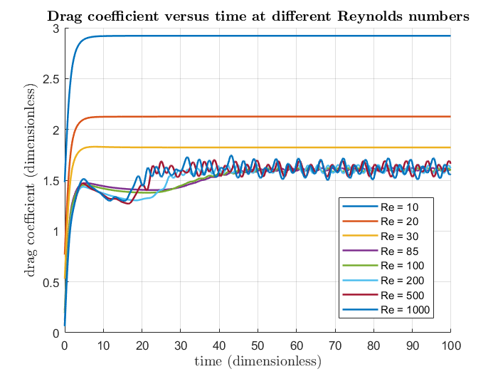

# vortex-simulation

## Welcome to the vortex-simulation project !

This repo is the result of a practical work supervised by Prof. Marc Fermigier during my studies at ESPCI Paris.

The software that was used to perform the simulation is called FreeFem++ (http://www3.freefem.org/) and was developed by a team of researchers from the Pierre and Marie Curie University (UPMC).

After running a few simulations, you can plot the following data with main.m : 

## Drag coefficient versus time 

## Average drag coefficient versus Reynolds number

