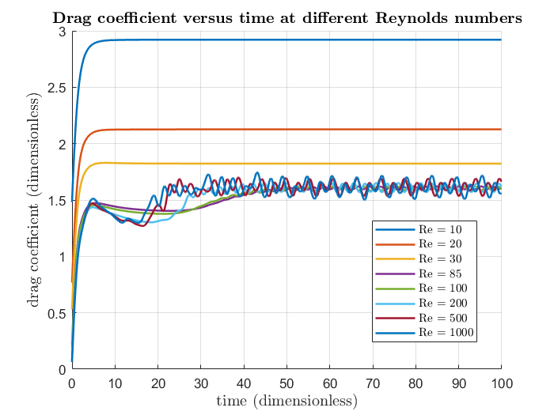
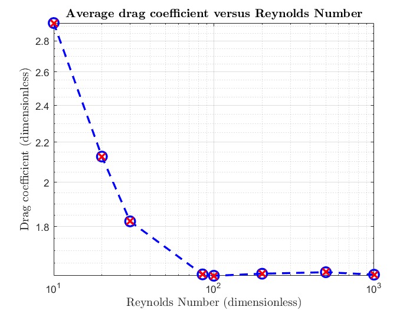
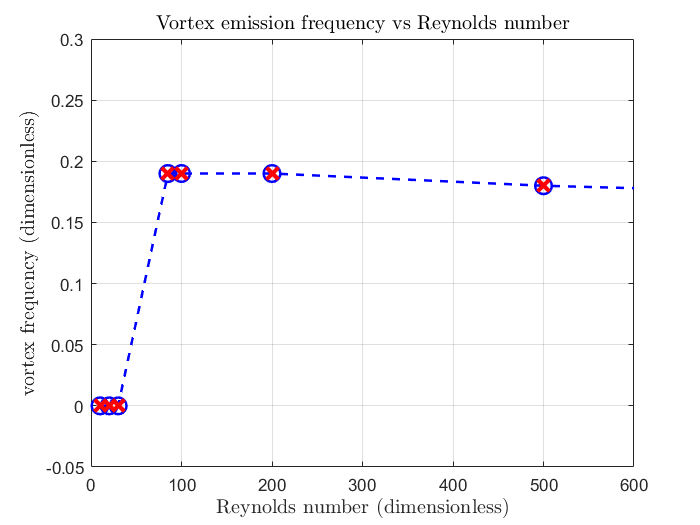

# vortex-simulation

## Welcome to the vortex-simulation project !

This repo is the result of a practical work supervised by Prof. Marc Fermigier as part of the Fluid Mechanics course at ESPCI Paris.
The purpose was to study the formation of vortices by an obstacle using a two-dimensional finite element based mechanical flow simulation tool.

The software that was used to perform the simulation is called FreeFem++ (http://www3.freefem.org/) and was developed at Pierre and Marie Curie University (UPMC).

## Instructions
To download this repo: ```$ git clone https://github.com/MatDagommer/vortex-simulation.git```

To run simulations, type ```FreeFem++ BVK_simple_2019.edp``` in prompt.
You can also launch FreeFem++ manually, and open ```BVK_simple_2019.edp```.

The prompt will show up three consecutive questions:
```Raffinement automatique du maillage pendant le calcul? (o/n):``` stands for "Automatic Mesh refinement during the calculation".
It is preferable that you choose the option "n", which is less expensive in computation time. 
```Entrer le nombre de Reynolds:``` stands for "Choose Reynolds number". You may choose a Reynolds number from 1 to 1000.
```Entrer le nombre d'itérations:``` stands for "Choose the number of iterations". I chose 1000 iterations for my simulations but may choose larger values.

## Analysis 
Computations are performed using dimensionless quantities. To do so, time was divided by the time needed for the fluid to go along the studied obstacle at average flow speed.
After running a few simulations, you can plot the following data with main.m : 

### Drag coefficient versus time 


### Average drag coefficient versus Reynolds number


### Main Result: vortex emission frequency

Vortex emission frequency is retrieved by measuring lift coefficient periodicity (FFT). 



We can notice that below a certain Reynolds threshold, the regime is aperiodic, which means that no vortex is emitted.
